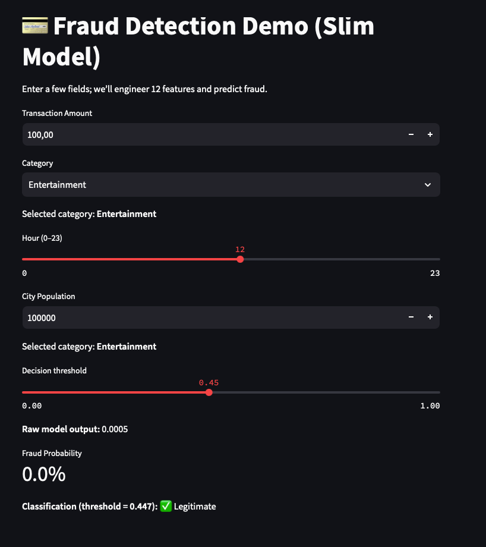

# CC_Fraud_Detection
# Credit Card Fraud Detection



This repository implements a Credit Card Fraud Detection pipeline using XGBoost, SHAP for model interpretation, and Streamlit for interactive demonstration. It is organized into:

* **notebooks/**: Jupyter notebooks covering end-to-end data exploration, feature engineering, model training, tuning, and interpretation.
* **scripts/**: Python utility modules:

  * `process_final.py`: `polprocess(df, cat_rates)` for consistent feature engineering.
* **artifacts/**: Serialized model & metadata for deployment:

  * `fraud_slim.json`: trained slim XGBoost Booster.
  * `slim_features.joblib`: list of features expected by the slim model.
  * `category_rates.joblib`: mapping of category → historical fraud rate.
  * `le_category.joblib`: LabelEncoder for transaction categories.
  * `uf_names.joblib`: user‑friendly category names.
* **streamlit\_app/**: a polished Streamlit application (`pol_app.py`) that loads artifacts and lets you simulate new transactions.

---

## 🔧 Installation

1. **Clone the repo**

   ```bash
   git clone https://github.com/<your‑username>/CC_Fraud_Detection.git
   cd CC_Fraud_Detection
   ```
2. **Create & activate** a Python environment (conda or venv):

   ```bash
   conda create -n fraud-detect python=3.11
   conda activate fraud-detect
   ```
3. **Install dependencies**

   ```bash
   pip install -r requirements.txt
   ```

## 📓 Jupyter Notebook

* Open `notebooks/CC_Fraud_polished.ipynb` to step through:

  1. **Setup & Data Load**: imports, Kaggle download, preview.
  2. **Preprocessing & Feature Engineering**: apply `polprocess()` to train/test splits.
  3. **Hyperparameter Tuning & Training**: train slim XGBoost with early stopping.
  4. **Model Interpretation**: SHAP summary & beeswarm plots.
  5. **Export Artifacts**: save model, feature list, encoders to `artifacts/`.

Run all cells to reproduce results and regenerate the `artifacts/` files.

## 🚀 Streamlit App

1. **Launch**:

   ```bash
   streamlit run streamlit_app/pol_app.py
   ```
2. **Simulate** new transactions by adjusting amount, category, hour, and population.
3. **Threshold slider** dynamically changes fraud vs. legitimate decision cutoff.

## 🗂️ Folder Structure

```
├── artifacts/               # trained models + metadata
│   ├── fraud_slim.json
│   ├── slim_features.joblib
│   └── ...
├── notebooks/
│   ├── CC_Fraud_polished.ipynb
│   └── NB_archive/...
├── scripts/
│   ├── process_final.py
│   └── booster_wrapper.py
├── streamlit_app/
│   └── pol_app.py
├── requirements.txt
└── README.md
```

## 📈 Results Summary

* **Slim Model**: 12‑feature XGBoost, AUC ≈ 0.99, PR‑AUC ≈ 0.80, F1 optimized at threshold ≈ 0.70.
* **Interpretation**: SHAP identifies top drivers (amount, category TE, hour patterns, etc.).

## 📂 Deployment

All required artifacts are in `artifacts/`. To deploy:

1. Ensure `artifacts/` is alongside `streamlit_app/`.
2. Run the app as above.

## ⚖️ License

This project is MIT‑licensed—feel free to reuse and adapt in your portfolio or demos.
